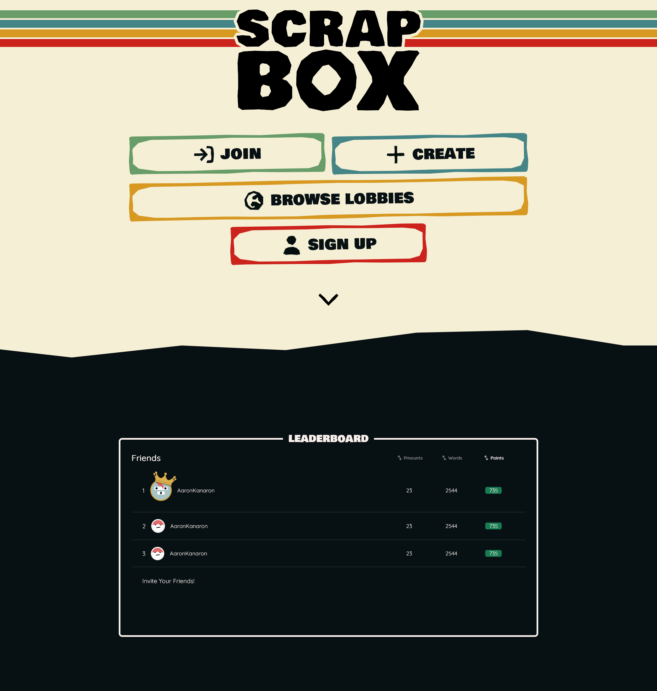

<div align="center" id="top"> 

  <!-- &#xa0; -->

  <!-- <a href="https://scrap.netlify.app">Demo</a> -->
</div>

<h1 align="center">Scrapbox</h1>

<p align="center">
  

  

  

  <!--  -->

  <!--  -->

  <!--  -->
</p>

<!-- Status -->
  

<h4 align="center"> 
	🚧  Scrapbox - Pågående byggnation...  🚧
</h4> 

<hr>

<p align="center">
  <a href="#dart-about">About</a> &#xa0; | &#xa0; 
  <!-- <a href="#sparkles-features">Features</a> &#xa0; | &#xa0; -->
  <!-- <a href="#rocket-technologies">Technologies</a> &#xa0; | &#xa0; -->
  <!-- <a href="#white_check_mark-requirements">Requirements</a> &#xa0; | &#xa0; -->
  <!-- <a href="#checkered_flag-starting">Starting</a> &#xa0; | &#xa0; -->
  <!-- <a href="#memo-license">License</a> &#xa0; | &#xa0; -->
  <a href="https://github.com/aaronkanaron" target="_blank">Author (Aaron)</a>  &#xa0; | &#xa0;
  <a href="https://github.com/arturr-h" target="_blank">Author (Artur)</a>
</p>

<br>

## <!--:dart:-->Om ##

Scrapbox är ett gratis onlinespel som du och dina vänner kan spela tillsammans. Du måste klura ihop meningar och svara på frågor med hjälp av ord som andra spelare har skrivit.

<!-- ## :sparkles: Features ##

:heavy_check_mark: Feature 1;\
:heavy_check_mark: Feature 2;\
:heavy_check_mark: Feature 3; -->

<!-- ## :rocket: Technologies ## -->

<!-- The following tools were used in this project:

- [Expo](https://expo.io/)
- [Node.js](https://nodejs.org/en/)
- [React](https://pt-br.reactjs.org/)
- [React Native](https://reactnative.dev/)
- [TypeScript](https://www.typescriptlang.org/)

## :white_check_mark: Requirements ##

Before starting :checkered_flag:, you need to have [Git](https://git-scm.com) and [Node](https://nodejs.org/en/) installed.

## :checkered_flag: Starting ##

```bash
# Clone this project
$ git clone https://github.com/{{YOUR_GITHUB_USERNAME}}/scrap

# Access
$ cd scrap

# Install dependencies
$ yarn

# Run the project
$ yarn start

# The server will initialize in the <http://localhost:3000>
```

## :memo: License ##

This project is under license from MIT. For more details, see the [LICENSE](LICENSE.md) file.


Made with :heart: by <a href="https://github.com/{{YOUR_GITHUB_USERNAME}}" target="_blank">{{YOUR_NAME}}</a>
 -->
&#xa0;

<!-- <a href="#top">Back to top</a> -->
